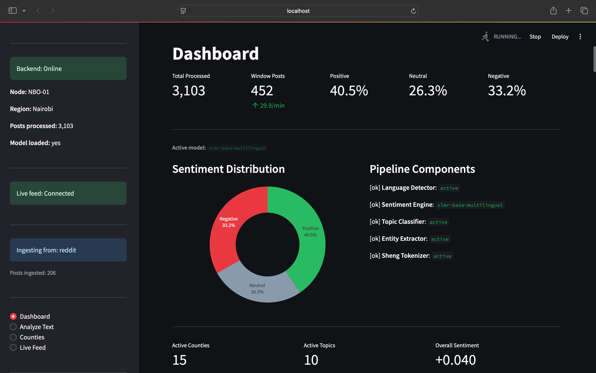
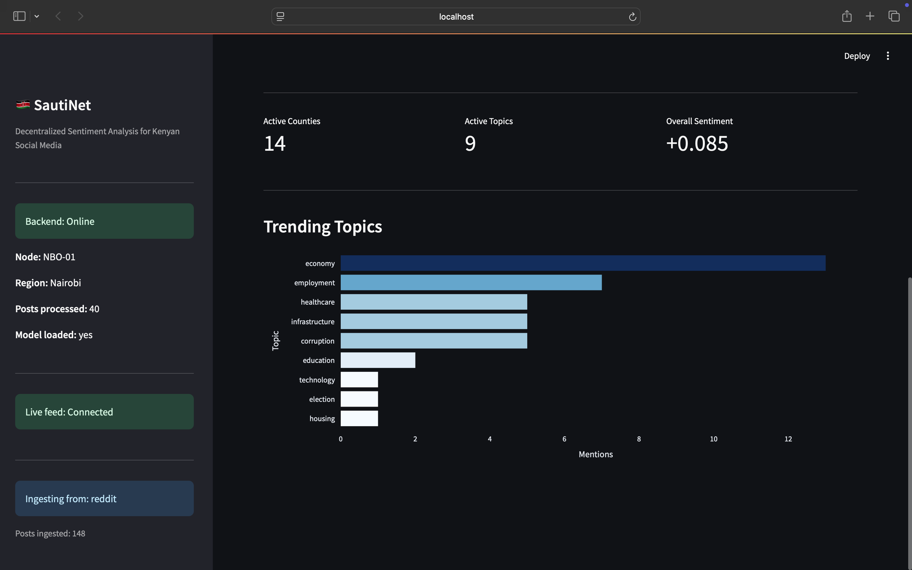
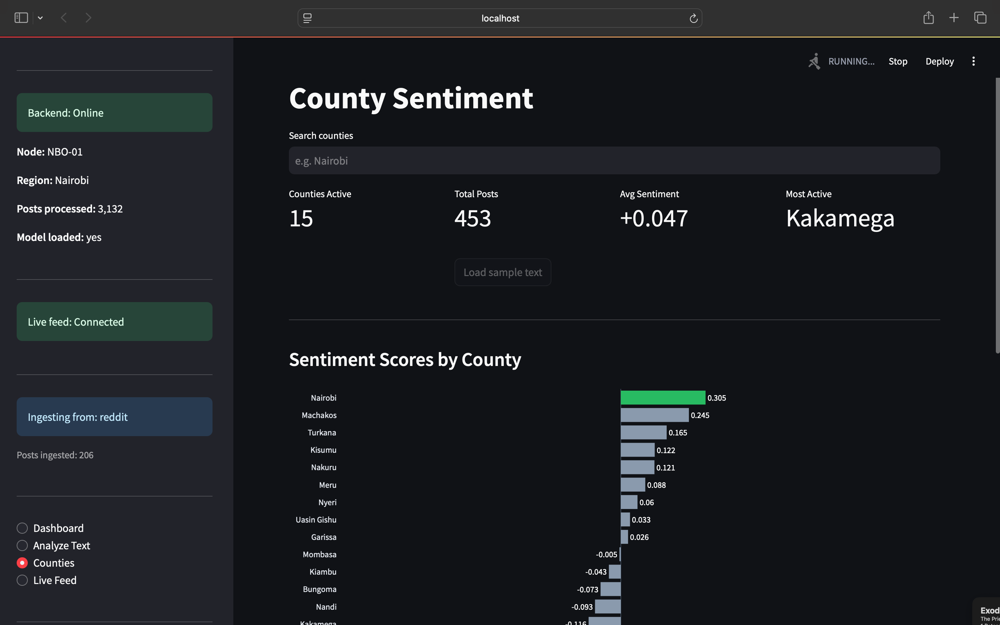
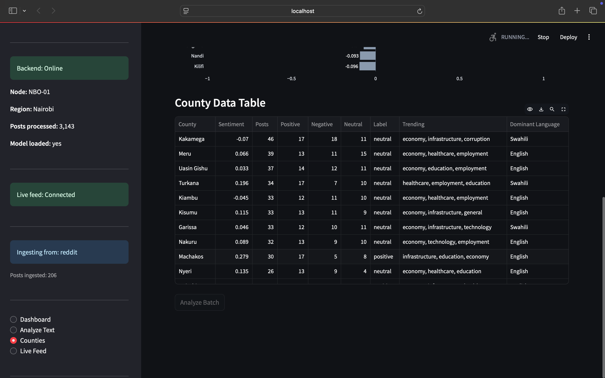
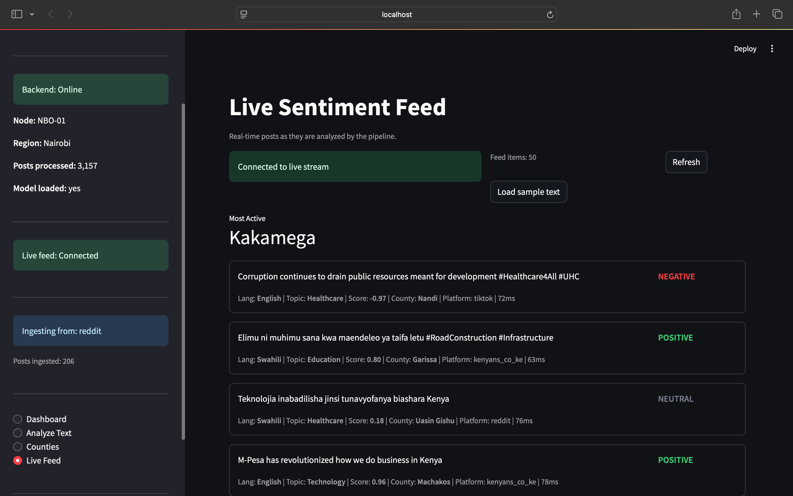

# 🇰🇪 SautiNet

**Decentralized Sentiment Analysis for Kenyan Social Media**

A distributed NLP platform that analyzes political sentiment and public opinion across Kenyan social media in real-time, supporting **English**, **Swahili**, and **Sheng**. Built as a distributed ML class project.

---

## Screenshots

### Dashboard
> 
> 

### County Sentiment
> 
> 


### Live Feed
> 

---

## Architecture

```
┌─────────────────────────────────────────────────────────────┐
│                    DATA INGESTION LAYER                      │
│         Reddit API │ Twitter/X │ Facebook │ TikTok          │
└──────────────────────────┬──────────────────────────────────┘
                           ▼
┌─────────────────────────────────────────────────────────────┐
│                      APACHE KAFKA                           │
│   sentikenya.raw.posts │ Partitioned by County │ 3 Nodes    │
└──────────────────────────┬──────────────────────────────────┘
                           ▼
┌─────────────────────────────────────────────────────────────┐
│                   NLP PROCESSING ENGINE                      │
│                                                             │
│  Language Detection  →  Sentiment Engine  →  Topic Classifier│
│  (EN / SW / Sheng)      (Hybrid Ensemble)    (14 categories) │
│                                                             │
│  Sheng Tokenizer  →  Entity Extractor  →  Aggregator        │
│  (Custom-built)      (Kenyan NER)          (County-level)   │
└──────────────────────────┬──────────────────────────────────┘
                           ▼
┌─────────────────────────────────────────────────────────────┐
│                  DECENTRALIZED STORAGE                       │
│    IPFS (Raw Data) │ TimescaleDB (Time-series) │ Redis       │
└──────────────────────────┬──────────────────────────────────┘
                           ▼
┌─────────────────────────────────────────────────────────────┐
│              API GATEWAY + STREAMLIT DASHBOARD              │
│    REST Endpoints │ WebSocket Streams │ Real-time Charts     │
└─────────────────────────────────────────────────────────────┘
```

### Processing Nodes

| Node | Region | Port |
|------|--------|------|
| NBO-01 | Nairobi | 8000 |
| MSA-01 | Mombasa | 8001 |
| KSM-01 | Kisumu | 8002 |

---

## Project Structure

```
sautiNet/
├── sautinet-ml-backend/        # FastAPI backend + NLP engine
│   ├── app/
│   │   ├── api/routes.py       # REST + WebSocket endpoints
│   │   ├── ml/
│   │   │   ├── pipeline.py         # NLP orchestrator
│   │   │   ├── language_detector.py # EN/SW/Sheng detection
│   │   │   ├── sentiment_engine.py  # Hybrid sentiment analysis
│   │   │   ├── sheng_tokenizer.py   # Custom Sheng tokenizer
│   │   │   ├── topic_classifier.py  # 14-category classifier
│   │   │   ├── entity_extractor.py  # Kenyan NER
│   │   │   └── custom_model.py      # BiLSTM + Attention (from scratch)
│   │   ├── services/
│   │   │   ├── kafka_service.py     # Kafka producer/consumer
│   │   │   ├── ipfs_service.py      # IPFS + Merkle trees
│   │   │   └── broadcast_service.py # WebSocket broadcasting
│   │   ├── workers/nlp_worker.py    # Background processing worker
│   │   ├── models/schemas.py        # Pydantic data models
│   │   └── main.py                  # App entry point + lifecycle
│   ├── config/settings.py           # Environment configuration
│   ├── data/
│   │   ├── sheng_lexicon.json       # 62-word Sheng vocabulary
│   │   ├── kenyan_entities.json     # 47 counties, parties, orgs
│   │   └── training_dataset.json    # Labeled training samples
│   ├── docker-compose.yml           # 3-node cluster + infra
│   ├── Dockerfile
│   └── requirements.txt
│
├── sautinet-frontend/          # Streamlit dashboard
│   ├── app.py                  # 4-page Streamlit SPA
│   └── requirements.txt
│
├── sautinet-custom-model/      # BiLSTM training environment
│   ├── app/ml/                 # Training scripts
│   └── data/                   # Training data
│
└── sautinet-finetuning-pipeline/ # Transformer fine-tuning
    ├── app/ml/                   # Fine-tuning scripts
    └── data/                     # Fine-tuning data
```

---

## NLP Pipeline

### Language Detection
- **English** — function word patterns (`the`, `is`, `are`, `with`)
- **Swahili** — morphological analysis (prefixes: `wa-`, `ni-`, `ana-`; suffixes: `-isha`, `-ika`)
- **Sheng** — custom lexicon matching + code-switching detection (gets priority when score > 0.25)

### Sentiment Analysis — Hybrid Ensemble

| Language | Strategy | Confidence |
|----------|----------|------------|
| English | XLM-R transformer | ~88% |
| Swahili | Transformer + phrase patterns | ~82% |
| Sheng | Lexicon + transformer + BiLSTM blend | ~72% |
| Mixed | Weighted ensemble by language scores | ~70% |

### Custom BiLSTM Model (Built from Scratch)

```
Input → Embedding(128) → BiLSTM(64×2 layers) → Self-Attention → FC(64) → Softmax(3)
```

~200K parameters vs 278M for XLM-R. Inference: <1ms vs ~40ms.

### Topic Categories (14)
`healthcare` · `education` · `economy` · `security` · `infrastructure` · `employment` · `corruption` · `devolution` · `agriculture` · `technology` · `housing` · `climate` · `election` · `fuel_prices`

### Kenyan NER
- 47 counties + aliases (`nai` → Nairobi, `eld` → Uasin Gishu)
- 9 political parties + abbreviations (UDA, ODM, Jubilee, Azimio...)
- Government bodies: Parliament, IEBC, KRA, DCI, EACC...
- Institutions: Safaricom, M-Pesa, universities, banks

---

## Tech Stack

| Layer | Technology |
|-------|-----------|
| Backend | Python 3.9+, FastAPI, Uvicorn |
| ML/NLP | Transformers (AfriSenti XLM-R), PyTorch |
| Streaming | Apache Kafka, WebSockets |
| Storage | TimescaleDB, IPFS, Redis |
| Frontend | Streamlit, Plotly |
| Deployment | Docker, docker-compose |

---

## Quick Start

### Prerequisites
- Python 3.9+
- ~2GB disk space (for transformer model download on first run)

### 1. Fix PATH (macOS)
```bash
echo 'export PATH="$PATH:/Users/$USER/Library/Python/3.9/bin"' >> ~/.zshrc
source ~/.zshrc
```

### 2. Backend

```bash
cd sautinet-ml-backend
pip3 install -r requirements.txt
uvicorn app.main:app --host 0.0.0.0 --port 8000
```

Wait for `SentiKenya is LIVE` — first run downloads the HuggingFace model (~1–2 GB).

### 3. Frontend

```bash
cd sautinet-frontend
pip3 install -r requirements.txt
streamlit run app.py
```

Open **http://localhost:8501**

### 4. Production Cluster (Docker)

```bash
cd sautinet-ml-backend
docker-compose up -d
```

Starts 3 nodes + Kafka + TimescaleDB + Redis + IPFS + Kafka UI.

| Service | URL |
|---------|-----|
| Nairobi Node | http://localhost:8000 |
| Mombasa Node | http://localhost:8001 |
| Kisumu Node | http://localhost:8002 |
| Kafka UI | http://localhost:8090 |
| IPFS Gateway | http://localhost:8080 |

---

## API Reference

| Method | Endpoint | Description |
|--------|----------|-------------|
| POST | `/api/v1/analyze` | Analyze single text |
| POST | `/api/v1/analyze/batch` | Batch analyze (max 100) |
| POST | `/api/v1/predict` | Lightweight inference (label + confidence) |
| GET | `/api/v1/counties` | All county sentiments |
| GET | `/api/v1/counties/{name}` | Single county detail |
| GET | `/api/v1/trending` | Trending topics |
| GET | `/api/v1/stats` | System statistics |
| GET | `/api/v1/health` | Node health check |
| GET | `/api/v1/language/detect?text=...` | Language detection |
| WS | `/ws/feed` | Real-time sentiment stream |
| WS | `/ws/counties` | County updates stream |

Interactive docs: **http://localhost:8000/docs**

### Example

```bash
curl -X POST http://localhost:8000/api/v1/analyze \
  -H "Content-Type: application/json" \
  -d '{"text": "Manze hii serikali iko rada wasee mambo ni poa"}'
```

```json
{
  "language": { "detected_language": "sh", "confidence": 0.99 },
  "sentiment": { "label": "positive", "score": 0.35, "confidence": 0.72 },
  "topics": { "primary_topic": "governance", "is_political": true },
  "processing_time_ms": 0.6
}
```

---

## Decentralization

- **IPFS** — raw posts pinned for tamper-proof audit trail
- **Merkle Trees** — batch verification across nodes
- **3 Processing Nodes** — Nairobi, Mombasa, Kisumu
- **Consensus** — multi-node sentiment scoring verification

---

## Team

Built for a Distributed ML class project.

---

## License

MIT
